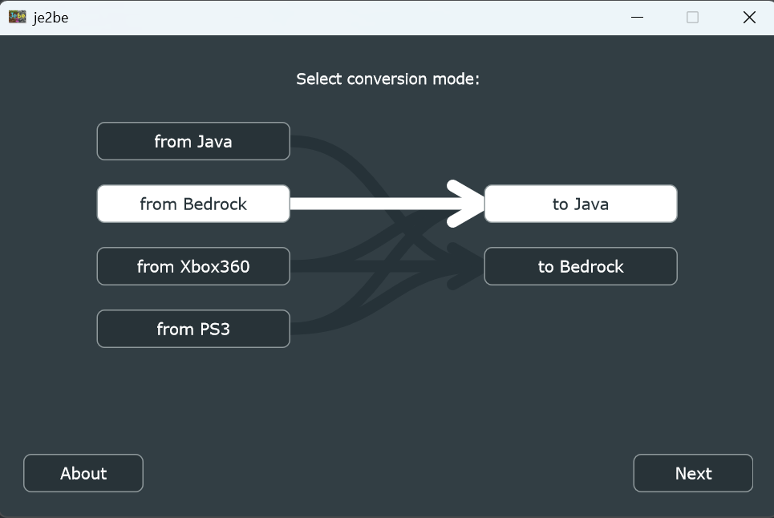

# BE-to-JE_tutorial

English | [简体中文](README_zh.md)

> A simple tutorial for converting Minecraft Bedrock Edition saves to Java Edition

## Map Converter

Recommend project: [kbinani/je2be-core: Map converter for Minecraft Java, Bedrock, Xbox360, and PS3 Edition](https://github.com/kbinani/je2be-core)

- This project converts saves between JE and BE formats almost perfectly, including all types of blocks, containers, items, entities and even custom map images.
- Windows version: https://www.microsoft.com/store/apps/9PC9MFX9QCXS
- Web app: [https://je2be.app](https://je2be.app/)

## Server Player Inventory Migration

For BDS server saves, in addition to converting the map, you will need to export players' inventory and enderchest, then manually convert them to Java version. You can use LL plugins to assist the migration work. The tutorial is as follows:

1. Configure BDS1.21.3 + LeviLamina 0.13.4, load the bedrock save to be converted.
2. Install  [YQ-LL-Plugins/BDS-InventoryExporter](https://github.com/YQ-LL-Plugins/BDS-InventoryExporter) and start the server. After the server is started, the plugin will export all players' inventory and enderchest to NBT format, store them in `plugins/InventoryExporter/saved`.
3. Use some tools to convert the NBT data to Java version and import it into the Java save.
4. If the previous step is not possible, another method:
   - Install LegacyScriptEngine-QuickJs and the plugin [YQ-LL-Plugins/ImportInventoryAsChest](https://github.com/YQ-LL-Plugins/ImportInventoryAsChest)
   - Copy all NBT data exported by `BDS-InventoryExporter` to `plugins/ImportInventoryAsChest/saved`.
   - Enter the game and execute command `importinv`
   - The plugin will generate an array of chests in the z-increasing direction, storing all the player's inventory and enderchest in order, and using noticeboards to record the name of the player the chests correspond to.
   - Use `je2be` to convert the save to Java and manually redistribute the items to players.
